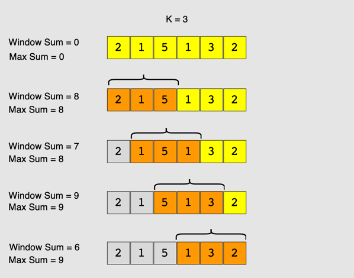

# Maximum Sum Subarray of Size K

## Problem statement

Given an array of positive numbers and a positive number **k**, find the maximum sum of any contiguous sub-array of size **k**.

### Examples

**Example 1**:

```
Input: [2, 1, 5, 1, 3, 2], k=3 
Output: 9
Explanation: Subarray with maximum sum is [5, 1, 3].
```

**Example 2**:

```
Input: [2, 3, 4, 1, 5], k=2 
Output: 7
Explanation: Subarray with maximum sum is [3, 4].
```

### Try it yourself

(See practice file: `scratchpad/03_sliding_window/maximum_sum_subarray_of_size_k.py`)

### Solution

A basic brute force solution will be to calculate the sum of all **k** sized sub-arrays of the given array to find the sub-array with the highest sum. We can start from every index of the given array and add the next **k** elements to find the sub-array’s sum. Following is the visual representation of this algorithm for "**Example-1**":



### Code

(See solution file: `03_sliding_window/maximum_sum_subarray_of_size_k.py`)

The above algorithm's time complexity will be **O(N * K)**, where **N** is the total number of elements in the given array. Is it possible to find a better algorithm than this?

### A better approach

If you observe closely, you will realize that to calculate the sum of a contiguous sub-array, we can utilize the sum of the previous sub-array. For this, consider each sub-array as a Sliding Window of size **k**. To calculate the sum of the next sub-array, we need to slide the window ahead by one element. So to slide the window forward and calculate the sum of the new position of the sliding window, we need to do two things:
1. Subtract the element going out of the sliding window, i.e., subtract the first element of the window.
2. Add the new element getting included in the sliding window, i.e., the element coming right after the end of the window.

This approach will save us from re-calculating the sum of the overlapping part of the sliding window. Here is what our algorithm will look like:

(See solution file: `03_sliding_window/maximum_sum_subarray_of_size_k.py`)

### Time complexity

The time complexity of the above algorithm will be **O(N)**.

### Space complexity

The algorithm runs in constant space **O(1)**.
